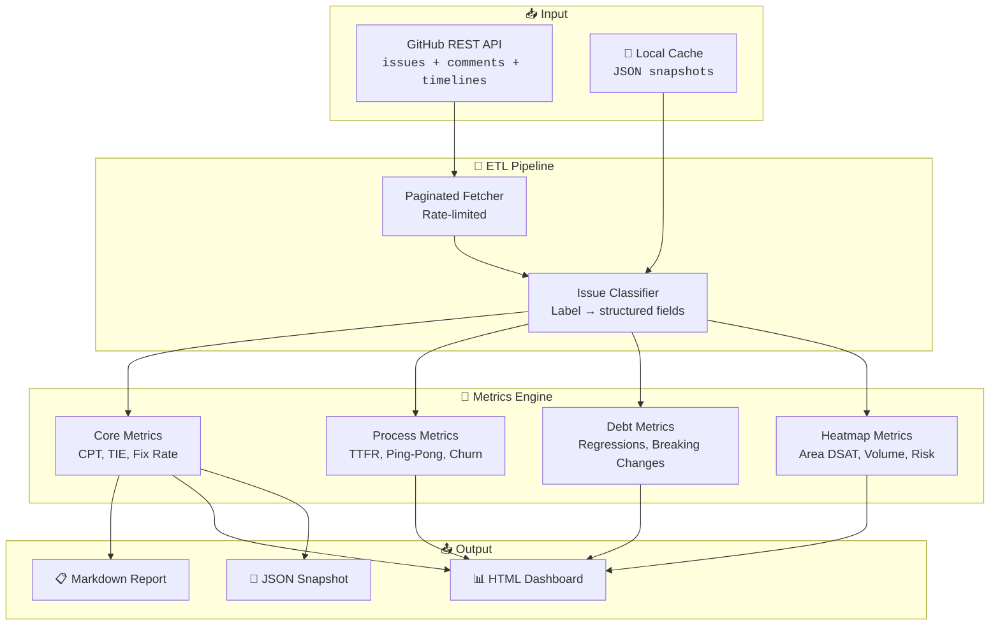

<div align="center">

```
 ██████╗ ██╗████████╗██╗  ██╗██╗   ██╗██████╗
██╔════╝ ██║╚══██╔══╝██║  ██║██║   ██║██╔══██╗
██║  ███╗██║   ██║   ███████║██║   ██║██████╔╝
██║   ██║██║   ██║   ██╔══██║██║   ██║██╔══██╗
╚██████╔╝██║   ██║   ██║  ██║╚██████╔╝██████╔╝
 ╚═════╝ ╚═╝   ╚═╝   ╚═╝  ╚═╝ ╚═════╝ ╚═════╝
      ██╗███████╗███████╗██╗   ██╗███████╗
      ██║██╔════╝██╔════╝██║   ██║██╔════╝
      ██║███████╗███████╗██║   ██║█████╗
      ██║╚════██║╚════██║██║   ██║██╔══╝
      ██║███████║███████║╚██████╔╝███████╗
      ╚═╝╚══════╝╚══════╝ ╚═════╝ ╚══════╝
 █████╗ ███╗   ██╗ █████╗ ██╗  ██╗   ██╗████████╗██╗ ██████╗███████╗
██╔══██╗████╗  ██║██╔══██╗██║  ╚██╗ ██╔╝╚══██╔══╝██║██╔════╝██╔════╝
███████║██╔██╗ ██║███████║██║   ╚████╔╝    ██║   ██║██║     ███████╗
██╔══██║██║╚██╗██║██╔══██║██║    ╚██╔╝     ██║   ██║██║     ╚════██║
██║  ██║██║ ╚████║██║  ██║███████╗██║      ██║   ██║╚██████╗███████║
╚═╝  ╚═╝╚═╝  ╚═══╝╚═╝  ╚═╝╚══════╝╚═╝      ╚═╝   ╚═╝ ╚═════╝╚══════╝
```

# GitHub Issue Analytics 📊

[](https://github.com/kustonaut/github-issue-analytics/actions/workflows/ci.yml)
[](https://www.python.org/downloads/)
[](https://opensource.org/licenses/MIT)
[](https://pypi.org/project/github-issue-analytics/)

**Turn thousands of GitHub issues into actionable intelligence. ETL, metrics, heatmaps, dashboards.**

> *Because at scale, you need data — not opinions.*

[**📦 PyPI**](https://pypi.org/project/github-issue-analytics/) · [**🤝 Contributing**](CONTRIBUTING.md)

</div>

---

## 🧠 The Problem

Hundreds of developers once signed an open letter about thousands of unresolved issues in a repo I manage.

The uncomfortable truth? I couldn't answer basic questions:
- **Which product areas are bleeding?** No idea.
- **What's the actual fix rate?** "We're working on it" isn't a number.
- **How old is the backlog — really?** Months? Years?
- **Are things getting better or worse?** Vibes don't count.

GitHub gives you issue counts. What you need is **intelligence.**

```
              GitHub Issues                              GitHub Issue Analytics
┌──────────────────────────────┐         ┌──────────────────────────────────────────┐
│  6,000+ open issues           │         │  Fix rate: 1.6% → 4.2% (↑163%)          │
│  "We're looking into it"     │  ───►   │  Median age: 847 days (P90: 1,842d)     │
│  Labels: ??? 🤷              │         │  Hotspot: Area-3 (38% of regressions)    │
│  Trend: ??? 📈📉❓            │         │  Stale attention: 127 items (>30d idle)  │
└──────────────────────────────┘         │  WoW trend: backlog ↓3.2%, TTFR ↑12%    │
                                         └──────────────────────────────────────────┘
```

---

## ⚡ Features

| | Feature | What It Does |
|---|---------|-------------|
| 📥 | **ETL Pipeline** | Paginated GitHub REST API fetcher with rate limiting, caching, and incremental sync |
| 📏 | **13-Metric Scorecard** | Fix rate, CPT, TIE, DSAT proxy, stale attention, regression rate, and more |
| 🗺️ | **Area Heatmaps** | Product area × severity matrix — see which areas bleed at a glance |
| 📊 | **HTML Dashboard** | Dark-themed interactive dashboard with 6 metric categories |
| 📈 | **WoW Trending** | Week-over-week delta tracking with directional indicators |
| 🏗️ | **Backlog Health** | Age distribution (7 buckets), unassigned rate, zero-comment, stale counts |
| 🔄 | **Process Metrics** | Auto-closure patterns, ping-pong detection, assignee churn, response times |
| 🏚️ | **Debt Analysis** | Regressions, breaking changes, API surface hotspots, platform fragmentation |
| 💬 | **Engagement Scoring** | Reactions + comments + unique commenters = community signal strength |
| ⚙️ | **YAML Config** | Define areas, labels, tracking patterns, thresholds — zero code changes |
| 📋 | **Markdown Reports** | Stakeholder-ready reports with tables, deltas, and per-area breakdowns |
| 💾 | **Snapshot History** | Weekly metric snapshots for long-term trend analysis |

---

## 🏗️ Architecture

### System Overview



### Metric Categories

| Category | Metrics | What It Reveals |
|----------|---------|----------------|
| **Core Health** | CPT, TIE, DTC, NIR, Fix Rate, Backlog | Overall repo health and throughput |
| **Responsiveness** | TTFR, TTC, TTCl | How fast you respond, triage, and close |
| **Composite Scores** | SHS (0-100), DSAT Proxy | Single-number health indicators |
| **Process** | Auto-closure, Ping-pong, Assignee Churn | Workflow efficiency and anti-patterns |
| **Debt** | Regressions, Breaking Changes, Platform Fragmentation | Technical debt accumulation |
| **Heatmap** | Area DSAT, Monthly Volume, Engagement, Risk | Where to focus attention |

---

## 🚀 Quick Start

### Install

```bash
pip install github-issue-analytics
```

### Configure

Create a `config.yaml` in your project root:

```yaml
repo: "owner/repo-name"

# Label taxonomy — map your repo's labels to structured categories
labels:
  areas:
    Frontend:
      - "area: frontend"
      - "component: ui"
    Backend:
      - "area: backend"
      - "area: api"
    Infrastructure:
      - "area: infra"
      - "area: devops"

  types:
    bug: ["bug", "type: bug"]
    feature: ["enhancement", "feature request", "type: feature"]
    question: ["question", "type: question"]
    regression: ["regression", "type: regression"]
    documentation: ["documentation", "type: docs"]

  statuses:
    triaged: ["status: triaged", "triaged"]
    in_progress: ["status: in progress", "in progress"]
    fixed: ["status: fixed", "fix committed"]
    wont_fix: ["wontfix", "status: won't fix"]
    needs_info: ["needs more info", "waiting for author"]

# Tracking ID patterns — detect linked work items
tracking_patterns:
  - name: "GitHub PR"
    pattern: '#\d+'
  - name: "Jira"
    pattern: '[A-Z]+-\d+'
  - name: "Linear"
    pattern: '[A-Z]+-[a-z0-9]+'

# Metric thresholds (for SHS scoring)
thresholds:
  target_fix_rate: 0.10          # 10% fix rate target
  target_median_age_days: 90     # 90-day median age target
  stale_days: 30                 # Days without activity = stale
  regression_penalty: 3          # Weight for open regressions in DSAT
  max_acceptable_ttfr_days: 7    # Target: first response within 7 days

# Org members (for response time calculations)
org_members:
  - "maintainer-bot"
  - "team-member-1"
  - "team-member-2"

# Bot accounts (excluded from community metrics)
bots:
  - "github-actions[bot]"
  - "dependabot[bot]"
  - "stale[bot]"
```

### Analyze

```bash
# Full analysis — fetch + compute + report
gia analyze --config config.yaml

# Generate HTML dashboard
gia dashboard --config config.yaml --output report.html

# Use cached data (skip API fetch)
gia analyze --config config.yaml --cached

# Week-over-week trending
gia trending --config config.yaml

# Export metrics as JSON
gia export --config config.yaml --format json --output metrics.json
```

### Python API

```python
from github_issue_analytics import Analyzer

analyzer = Analyzer.from_config("config.yaml")

# Fetch and classify issues
issues = analyzer.fetch()
classified = analyzer.classify(issues)

# Calculate all metrics
metrics = analyzer.compute_metrics(classified)

print(f"Fix rate: {metrics.fix_rate:.1%}")
print(f"Median age: {metrics.median_age_days:.0f} days")
print(f"Service Health Score: {metrics.shs:.0f}/100")
print(f"Stale items: {metrics.stale_count}")

# Generate report
analyzer.generate_report(metrics, output="report.md")

# Generate dashboard
analyzer.generate_dashboard(metrics, output="dashboard.html")
```

---

## 📏 The 13 Metrics

### Core Health

| # | Metric | Full Name | What It Measures |
|---|--------|-----------|-----------------|
| 1 | **CPT** | Customer Pain Time | Issue age distribution — mean, median, P90 by segment |
| 2 | **TIE** | Time in Engineering | Age of issues linked to work items (has tracking ID) |
| 3 | **DTC** | Days to Close | How long issues wait before resolution |
| 4 | **NIR** | New Incident Rate | Monthly filing trend with trailing averages |
| 5 | **ER** | Escalation Rate | Regressions + high-reaction + needs-attention composite |
| 6 | **Fix Rate** | Fix Rate | Percentage of issues at fixed/resolved status |
| 7 | **Backlog** | Backlog Health | Age brackets, unassigned rate, zero-comment, stale counts |

### Responsiveness

| # | Metric | Full Name | What It Measures |
|---|--------|-----------|-----------------|
| 8 | **TTFR** | Time to First Response | How fast org members respond to new issues |
| 9 | **TTC** | Time to Triage | Rate of untriaged issues (no status label) |
| 10 | **TTCl** | Time to Close | Wait time for near-close issues |

### Composite Scores

| # | Metric | Full Name | What It Measures |
|---|--------|-----------|-----------------|
| 11 | **SHS** | Service Health Score | Weighted 0–100 composite of all metrics |
| 12 | **DSAT** | Dissatisfaction Proxy | High-reaction + old-untracked + no-response + stale regressions |
| 13 | **Per-Area** | Per-Area Breakdown | All metrics sliced by configured area labels |

---

## 🗺️ Dashboard Preview

The HTML dashboard provides 6 analysis categories:

| Tab | What You See |
|-----|-------------|
| **Process** | Auto-closure rates, response times, stale attention, backlog age distribution |
| **Debt** | Regression trends, breaking changes, API hotspots, platform fragmentation |
| **Heatmap** | Area × severity matrix, monthly volume trends, top engaged issues |
| **DevEx** | Developer experience signals, documentation gaps, onboarding friction |
| **Platform** | Cross-platform issues, version-specific problems |
| **Versioning** | Version adoption curves, deprecation tracking |

---

## 🔗 Cross-Repo Integration

GitHub Issue Analytics is part of the [kustonaut](https://github.com/kustonaut) PM toolchain:

| Repo | Integration |
|------|-------------|
| [issue-sentinel](https://github.com/kustonaut/issue-sentinel) | Classification results feed into analytics as structured input |
| [pm-signals](https://github.com/kustonaut/pm-signals) | Daily signal context enriches issue analysis |
| [llm-eval-kit](https://github.com/kustonaut/llm-eval-kit) | Quality checks for generated reports and dashboards |

---

## 🧑‍💻 Development

```bash
# Clone
git clone https://github.com/kustonaut/github-issue-analytics.git
cd github-issue-analytics

# Install dev dependencies
pip install -e ".[dev]"

# Run tests
pytest

# Lint
ruff check src/
```

---

## 📄 License

MIT — see [LICENSE](LICENSE) for details.

---

<div align="center">

**Built by [@kustonaut](https://github.com/kustonaut)** — open-source tools for engineering teams at scale.

</div>
